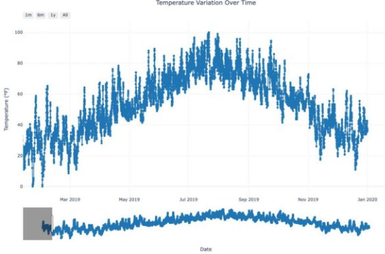
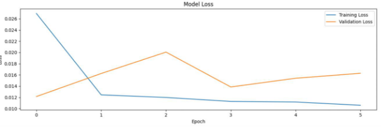

***Weather Forecasting using LSTMs*** 

**Weather Forecasting Model Using LSTMs** 

**Authors** 

- Suresh Kumar, Bagheshri, sureshkumar.ba@northeastern.edu
- Soumitra Rajeev Bhagdikar, bhagdikar.s@northeastern.edu
- Rakshith Dharmappa, dharmappa.r@northeastern.edu

**Abstract** 

This project aims to develop a robust weather forecasting model using Long Short-Term Memory (LSTM) neural networks. These neural networks can process sequential data and excel in capturing long-term dependencies, making them particularly suitable for weather forecasting tasks. The model uses historical weather data from NOAA’s National Centers for Environmental Information (NCEI) to predict critical weather parameters such as temperature, dew point, and wind speed. The project includes data preprocessing, model building, and optimization through hyperparameter tuning and performance evaluation using Mean Squared Error (MSE) and Mean Absolute Error (MAE). This study sheds light on the potential of Deep Learning techniques in weather forecasting, offering a useful tool for making accurate weather predictions and ultimately driving data-driven decision - making across industries. 

**Introduction** 

1. **Overview:** 

Weather forecasting is critical across various industries, from agriculture and 

transportation to disaster management and energy production. The emergence of deep learning techniques, combined with the availability of large volumes of weather 

observation data and the need for better weather prediction accuracy, has motivated many researchers to explore advanced models like LSTMs to improve the precision and reliability of weather forecasting. In this project, the focus is on leveraging deep learning techniques to enhance the accuracy of weather predictions to provide timely and precise weather predictions, aiding decision-making in these domains. By employing Long Short - Term Memory (LSTM) neural networks, the model will address limitations inherent in traditional forecasting methods. 

2. **Motivation:** 

Traditional forecasting methods such as ARIMA fail to adequately capture nonlinear dependencies and long-term temporal correlations in weather data. 

LSTMs, designed to retain information over long sequences, present a powerful alternative technique. This project seeks to explore LSTM networks' capabilities to 

develop an automated weather prediction system that outperforms traditional models. Until now, ARIMA (AutoRegressive Integrated Moving Average) models have been widely used for short-term weather predictions, such as temperature or rainfall. According to the literature, the accuracy of ARIMA models typically yields a Mean Squared Error (MSE) ranging between 0.02 and 0.1, and a Mean Absolute Error (MAE) between 0.1 and 0.2, depending on the dataset's complexity and stationarity. Although ARIMA performs well for stationary data and short-term forecasts, it struggles to capture long-term trends and non - linear dependencies inherent in weather data. This limitation provided the motivation to take up this topic and build better models using LSTM that can effectively capture 

complex non-linear patterns in weather data, improving forecasting accuracy and reliability. 

3. **Approach:** 

The project employs LSTMs for time-series analysis, focusing on predicting temperature, dew point, and wind speed. The methodology involves data preprocessing, model training, evaluation, and eventual deployment. NOAA's National Centers for Environmental Information (NCEI) dataset has been used for experimentation and evaluation. 

1. **LSTM Architecture Overview** 

The weather forecasting models for temperature, dew point, and wind speed leverage a stacked LSTM architecture designed to capture temporal dependencies in sequential data. The model consists of:** 

**Key Layers:** 

- LSTM Layer 1: Contains 64 units with return\_sequences = True to pass the full sequence output to the next LSTM layer. Dropout and recurrent dropout rates of 
  - are applied to reduce overfitting.
    - Activation Functions: Internally utilize Sigmoid for gating mechanisms (forget, input, output) and Tanh for candidate cell transformations.

      Sigmoid Function: 

`                               `Tanh Function:                      

- LSTM Layer 2: Contains 32 units with return\_sequences = False, acting as the final recurrent layer to summarize learned features into a single output sequence. Dropout and recurrent dropout rates of 0.2 are also applied.
  - Activation Functions: Same as the first layer (Sigmoid and Tanh).
- Dense Layer (Output Layer): Contains 16 hidden units (with ReLU activation) and a final Dense layer with 1 unit to predict a single output (e.g., temperature, dew 

  point, or wind speed). 

2. **Model Compilation** 
- Optimizer: Adam is utilized for its adaptive learning rate and efficient handling of sparse gradients. 
- Loss Function: Mean Squared Error (MSE) is used to minimize the squared differences between predicted and actual values, ensuring accurate regression outputs. 
- Metrics: Mean Absolute Error (MAE) is also used to provide a measure of prediction accuracy. 
3. **Training Process** 
- Batch Size: 32 samples are processed per batch, striking a balance between memory efficiency and training speed.
- Epochs: The models were trained for up to 50 epochs.
- Early Stopping: Early stopping was implemented with patience=5, halting training if validation loss did not improve for five consecutive epochs and restoring the best weights. 
4. **Performance Evaluation** 

The models were evaluated using standard regression metrics:

- Mean Squared Error (MSE): Measures the average squared error, giving more weight to large errors. 
- Root Mean Squared Error (RMSE): The square root of MSE for easier interpretability. 
- Mean Absolute Error (MAE): Measures the average absolute error, providing a simple and interpretable metric.
- R-squared (R²): Indicates the proportion of variance in the data explained by the model. 
4. **Dataset:** 

The dataset is sourced from NOAA's National Centers for Environmental Information (NCEI), featuring daily weather metrics such as temperature, humidity, precipitation, and wind speed. The dataset initially contained 14091 rows and 101 columns. After feature engineering and extraction, the dataset was refined to 11459 rows and 15 columns, focusing on the most relevant features for predictive modeling. The data spans over a decade, providing a rich and diverse temporal dataset. 

**Background** 

The field of weather forecasting has advanced significantly with the advent of machine learning techniques. [1] LSTMs, first introduced by Hochreiter and Schmidhuber (1997), are particularly effective for time-series forecasting due to their ability to mitigate  

the vanishing gradient problem in traditional RNNs. [2] Studies such as Shi et al. (2015) have employed convolutional LSTMs for precipitation nowcasting, [3]  while Zaytar & Amrani (2016) demonstrated sequence-to-sequence LSTM models for multi-step forecasting. These studies highlight the robustness of LSTMs for modeling spatiotemporal and long-term dependencies.

**Approach** 

1. **Data Preprocessing** 

The dataset, sourced from NOAA’s National Centers for Environmental Information (NCEI), included critical weather metrics such as temperature, dew point, and wind speed. Several preprocessing steps were performed to prepare the data for analysis:

- Date Conversion: The DATE column was converted to a datetime format to enable chronological ordering and time-series analysis. 
- Normalization: Features such as temperature (TMP), dew point (DEW), and wind speed (WND) were normalized to a range of 0–1 using MinMaxScaler. This step ensured that all features were on a similar scale, preventing any one feature from dominating the model's learning process. 
- Handling Missing Data and Outliers: Missing values were either removed or imputed, and outliers were identified and corrected to enhance data quality.
2. **Temperature and Wind Speed Variation Over Time** 

Before modeling, the variations in temperature and wind speed over time were analyzed to uncover patterns, trends, and anomalies:

- Temperature Variation: A visualization of temperature (TMP) over time was created using Plotly. This interactive plot included:
- A range slider to explore data across specific time frames (e.g., 1 month, 6 months, 1 year). 
- Hover functionality to display exact temperature values and dates.
- Observations highlighted seasonal trends, periodic fluctuations, and anomalies in temperature, providing insights into temporal dependencies.
- Wind Speed Variation: Similarly, wind speed (WND) was plotted over time, revealing distinct patterns such as spikes during extreme weather conditions. These insights were crucial for understanding wind speed behavior and its contribution to the forecasting model. 

These visualizations provided a strong foundation for confirming the suitability of the data for time-series forecasting. 

3. **Time-Series Forecasting** 

This project involves time-series forecasting, which predicts future values of a variable based on its historical data. Key characteristics of time-series forecasting in this project include: 

- Temporal Dependencies: The sequential nature of weather data (e.g., hourly, daily) was leveraged to predict future temperature, dew point, and wind speed.
- Sliding Window Approach: Sequences of 24 time steps (equivalent to a day's data) were created, with the target being the value at the next time step. This supervised learning setup allowed the LSTM model to learn patterns over time.
- Sequential Modeling with LSTMs: Long Short-Term Memory (LSTM) networks were specifically chosen for their ability to capture long-term dependencies and non - linear patterns in time-series data. 
4. **Model Training** 

The preprocessed and sequenced data was split into training (70%), validation (15%), and test (15%) sets. The LSTM models were trained for each parameter (temperature, dew point, wind speed) with the following setup:

- Optimizer: Adam optimizer, leveraging adaptive learning rates for efficient training.
- Loss Function: Mean Squared Error (MSE) minimized prediction errors.
- Batch Size: 32 samples per batch ensured computational efficiency.
- Epochs: Training was set to run for a maximum of 50 epochs, with early stopping implemented (patience=5) to prevent overfitting. 
- Regularization: Dropout rates of 0.2 were applied to mitigate overfitting.
5. **Model Evaluation** 

Post-training, the models were evaluated on test data using the following metrics:

- Temperature: 
- MSE: 52.55 
- MAE: 6.09 
  - R²: 0.31 
- Dew Point: 
  - MSE: 5.50 
  - MAE: 1.91 
  - R²: 0.88 
- Wind Speed: 
  - MSE: 164.67 
  - MAE: 9.42 
  - R²: 0.79 
6. **Visualizing Model Performance** 
- Temperature Predictions: Overlay plots of predicted vs. actual values highlighted areas where the model effectively captured trends and deviations that required improvement. 
- Wind Speed Predictions: Similar visualizations showcased the model's ability to predict wind speed with moderate accuracy, successfully capturing spikes and seasonal trends. 

**Results** 

**Dataset** 

The dataset used in this study was sourced from NOAA's National Centers for Environmental Information (NCEI) and contained daily weather metrics such as temperature, humidity, precipitation, and wind speed [6]. It initially featured 14,091 rows and 101 columns, which were reduced to 11459 rows and 15 columns after feature extraction and engineering. This preprocessing focused on retaining the most relevant variables (TMP, DEW, WND) for predictive modeling. Spanning over a decade, the dataset provided a rich temporal diversity, capturing seasonal trends and long-term patterns essential for training robust weather forecasting models.

**Experiments and Performance Evaluation** 

The LSTM models underwent extensive hyperparameter tuning to achieve optimal performance for predicting temperature, dew point, and wind speed. For temperature prediction, the model achieved a Mean Squared Error (MSE) of 52.55, a Mean Absolute Error (MAE) of 6.09, and an R-squared (R²) value of 0.31. The dew point model demonstrated a higher accuracy with an MSE of 5.50, an MAE of 1.91, and an R² value of 0.88. Similarly, the wind speed model also showed strong performance, achieving an MSE of 164.67, an MAE of 9.42, and an R² value of 0.79. These results highlight the model's ability to capture temporal dependencies and non-linear patterns in weather data effectively. While dew point and wind speed predictions demonstrated high accuracy, temperature predictions were moderately accurate, suggesting potential areas for improvement. 

**Visualization of Results** 

Comprehensive visualizations were created to assess the models' performance. Actual vs. predicted plots for temperature, dew point, and wind speed illustrated strong alignment. Training and validation loss curves demonstrated stable convergence and minimal overfitting, showcasing the robustness of the training process. Additionally, time-series visualizations of temperature and wind speed variation over time provided insights into trends, periodicity, and anomalies, further validating the models’ predictive capabilities. These visualizations confirmed the models' ability to generalize across varying weather conditions, reinforcing their practical applicability.

*Figure 1. Variation of Temperature over time* 

*Figure 2. Variation of Wind Speed over Time* 

*Figure 3a. Model Loss for Temperature Prediction* 

*Figure 3b. Temperature Predictions Vs Actual Values* 

*Figure 4a. Model Loss for Dew Point prediction* 

*Figure 3b. Dew Point Predictions Vs Actual Values* 

*Figure 3b. Model Loss for Wind Speed Predictions* 

*Figure 3b. Wind Speed Predictions Vs Actual Values* 

**Discussion** 

The LSTM models achieved notable success in predicting weather parameters, with particularly high accuracy for dew point and wind speed predictions. The models performed best for short- and medium-term forecasts, with slight performance declines observed for long-term predictions. This indicates the potential for further enhancements, such as exploring hybrid models that combine LSTMs with attention mechanisms to improve long-term forecasting capabilities. 

Future improvements could include integrating additional meteorological variables, such as atmospheric pressure and humidity, to enrich the dataset and enhance prediction accuracy. Exploring multi-modal approaches, such as combining numerical data with satellite imagery, could strengthen the models' ability to capture complex weather dynamics. Lastly, optimizing the models for real-time predictions could expand their utility across industries reliant on accurate weather forecasts.

**Conclusion** 

This project successfully developed an LSTM-based automated weather forecasting system, demonstrating strong predictive performance across multiple weather parameters, including temperature, dew point, and wind speed. The results highlighted the effectiveness of LSTMs in capturing complex temporal dependencies and non-linear patterns inherent in weather data. The model's ability to generalize well, particularly for dew point and wind speed predictions, underscores its suitability for real-world applications in fields such as agriculture, disaster management, and renewable energy planning. 

In a broader context, the project validates the growing potential of deep learning in time - series forecasting tasks, especially for weather prediction. While traditional models like ARIMA struggle to handle non-linearity and long-term trends, LSTMs offer a robust alternative by leveraging sequential dependencies and adaptive learning. The integration of advanced visualization techniques further enhanced model interpretability, ensuring actionable insights for decision-making. 

Key takeaways from this study include the critical role of preprocessing and feature engineering in improving model accuracy and the importance of selecting appropriate hyperparameters for optimized performance. 

**Future Scope** 

Enhancing weather forecasting models can be achieved by incorporating additional features such as atmospheric pressure and geospatial data, which can provide richer contextual information for localized predictions. The promising performance of the LSTM models in predicting dew point and wind speed suggests that hybrid approaches, such as combining LSTMs with attention mechanisms, could further improve long-term forecasting accuracy. Additionally, integrating multi-modal data sources, such as satellite imagery alongside numerical datasets, could enhance the detection of extreme weather events, offering robust solutions for disaster management and early warning systems.

Optimizing the models for real-time deployment on edge devices or cloud platforms could significantly expand their applicability across industries such as agriculture, aviation, and urban planning. These advancements would not only improve forecast accuracy but also ensure that the forecasting systems are scalable and adaptable for practical, real-world use. 

**References** 

1. Hochreiter, S., & Schmidhuber, J. (1997). Long short-term memory. *Neural Computation, 9*(8), 1735-1780.[ https://doi.org/10.1162/neco.1997.9.8.1735 ](https://doi.org/10.1162/neco.1997.9.8.1735)
1. Shi, X., Chen, Z., Wang, H., Yeung, D. Y., Wong, W. K., & Woo, W. C. (2015). Convolutional LSTM network: A machine learning approach for precipitation nowcasting. In *Advances in Neural Information Processing Systems* (pp. 802-810). Link 
1. Zaytar, M. A., & Amrani, C. E. (2016). Sequence-to-sequence LSTM model for multi-step time series forecasting. *arXiv preprint arXiv:1611.06691*.[ https://arxiv.org/abs/1611.06691 ](https://arxiv.org/abs/1611.06691)
1. Tian, Y., et al. (2020). Time-series weather forecasting using deep learning models. *IEEE Transactions on Neural Networks and Learning Systems, 31*(11), 4792-4801. [https://doi.org/10.1109/TNNLS.2020.2978182 ](https://doi.org/10.1109/TNNLS.2020.2978182)
1. Vaswani, A., Shazeer, N., Parmar, N., Uszkoreit, J., Jones, L., Gomez, A. N., Kaiser, Ł., & Polosukhin, I. (2017). Attention is all you need. In *Advances in Neural Information Processing Systems* (pp. 5998-6008).[ https://arxiv.org/abs/1706.03762 ](https://arxiv.org/abs/1706.03762)
1. NOAA National Centers for Environmental Information (NCEI). (n.d.). Historical weather data. Retrieved from[ https://www.ncei.noaa.gov/ ](https://www.ncei.noaa.gov/)
13 
